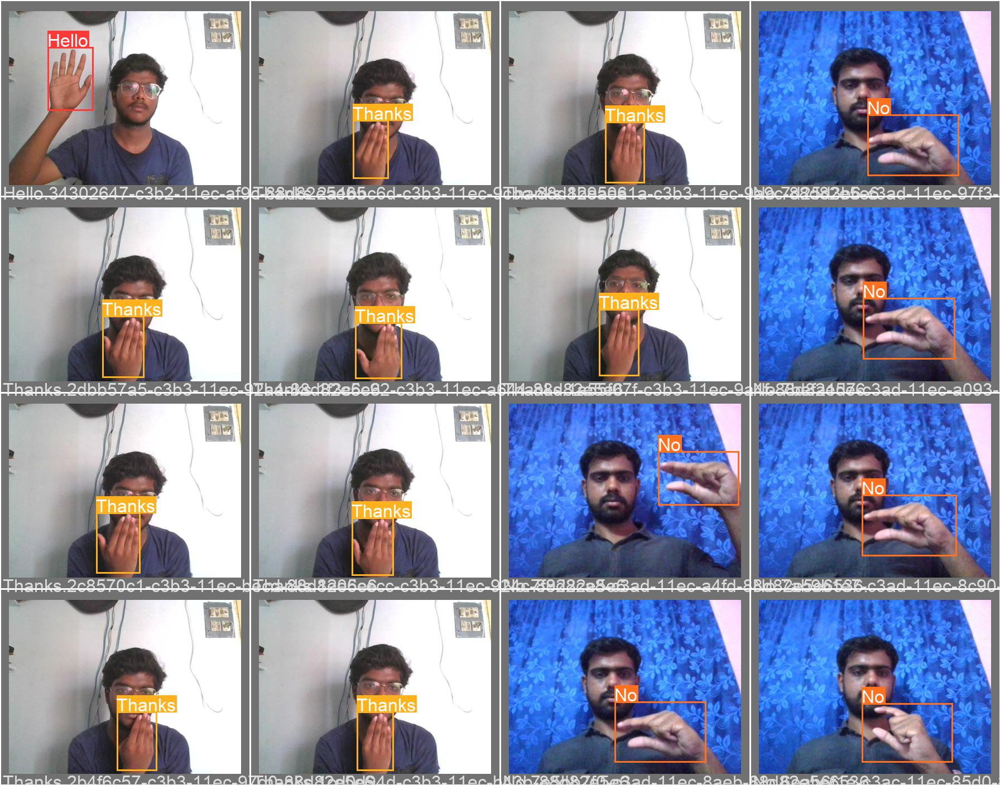

## Sign language object detection using yolov5

#### Conversing with people having a hearing disability is a major challenge. Deaf and Mute people use hand gesture sign language to communicate, hence normal people face problems in recognizing their language by signs made. Hence there is a need for systems that recognize the different signs and conveys the information to normal people.

#### In this sign language detection project we trained with 5 signs namely 'Hello','Yes','No','Thanks','IloveYou'

#### You can find the dataset used for this project in the location Data\Sign_language_data.zip having the both train and test data with annotations. For the annotation of custom images you can use the Annotation Tool present in the git repo. 

#### The sample test images you can find them in the loaction  yolov5/runs/detect/exp5/ . Some random tested images are shown below.

