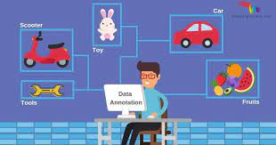
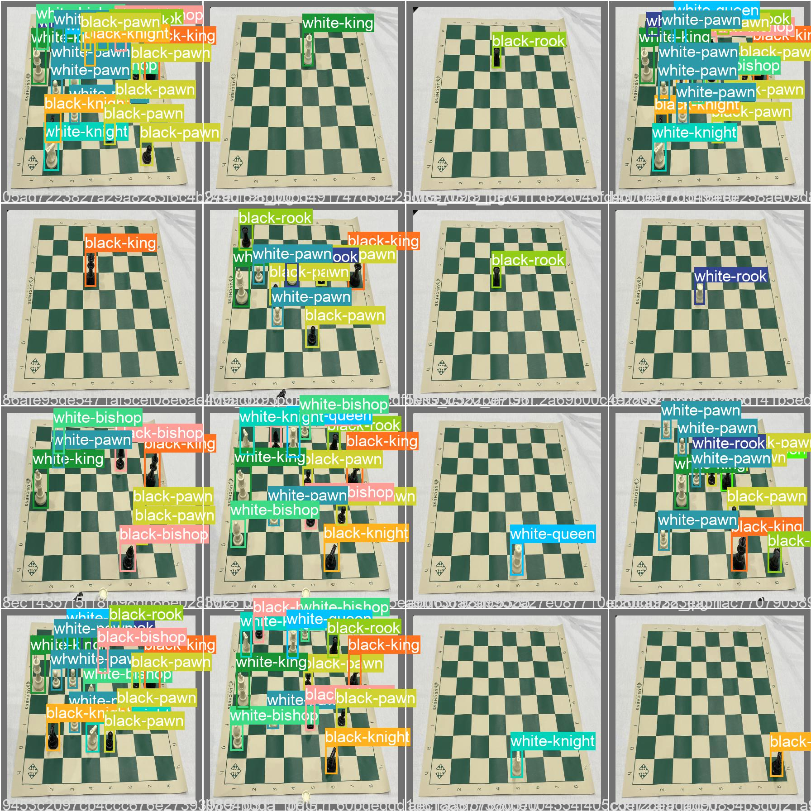

## chess pieces object detection using yolov5

#### This project determines the positions of each piece on a physical chessboard, so that a computer can record a game of chess by noting down the piece positions at the end of each turn. It determines each move so that the game can be replayed later without watching actual footage. The project allows for easy viewing of past games. An image of the chessboard is analyzed to detect each square on the board, and each piece's location. This is then done for each turn, so that the system can keep track of an entire game.

#### In this Chess pieces  object detection project we trained with 13 classes. This is a dataset of Chess board photos and various pieces. All photos were captured from a constant angle, a tripod to the left of the board. The bounding boxes of all pieces are annotated as follows: white-king, white-queen, white-bishop, white-knight, white-rook, white-pawn, black-king, black-queen, black-bishop, black-knight, black-rook, black-pawn. There are 693 labels across 693 images.

#### We get this dataset from the kaggle website (https://www.kaggle.com/ahmedhaytham/chess-object-detection-yolov5-for-chess). You can find the dataset used for this project in the location Data\chess_dataset.zip having the both train and test data with annotations. For the annotation of custom images you can use the Annotation Tool present in the git repo.

#### The sample test images you can find them in the loaction  yolov5/runs/detect/exp/ . Some random tested images are shown below.

