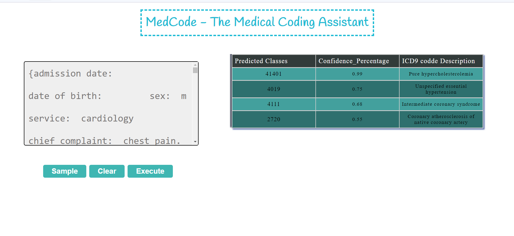

#### Install the required Python Packages to run the project code. Open the cmd in the present working directory(Project_code) and paste the below code
pip install requirements.txt

####  After installing those required Python packages. Run the python script of code.py file in the pwd(Project_code) by using the following command.
python code.py

####  After running the script Copy the url get from the command prompt . Open it in the browser
url like this http://127.0.0.1:5000/ 

####  The Sample image of the designed webpage using django

